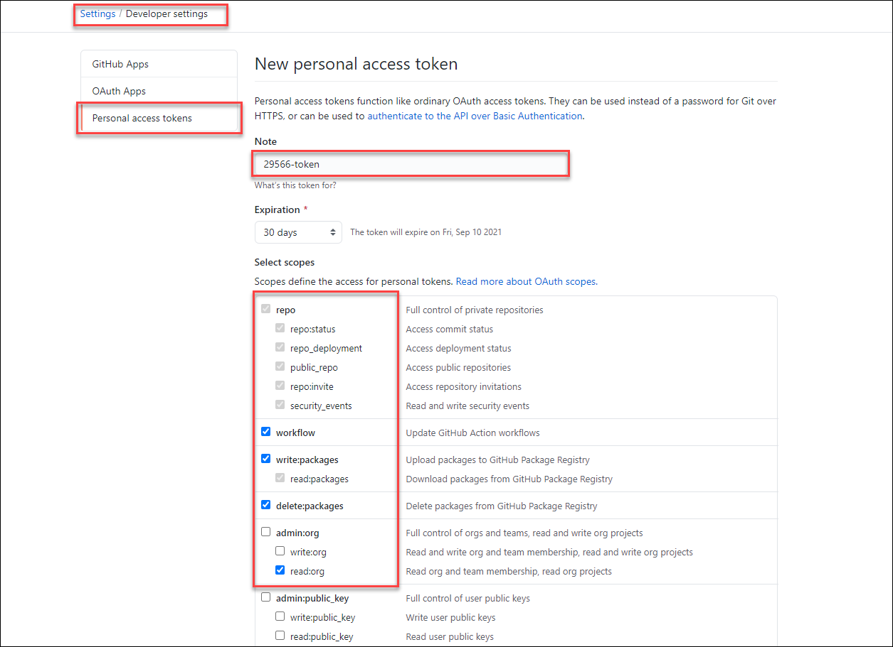
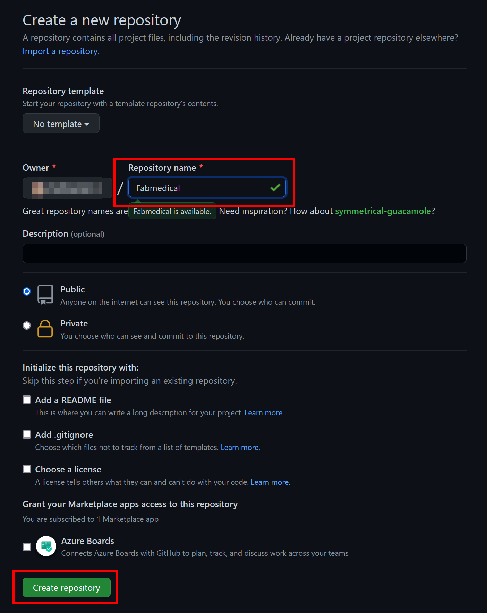
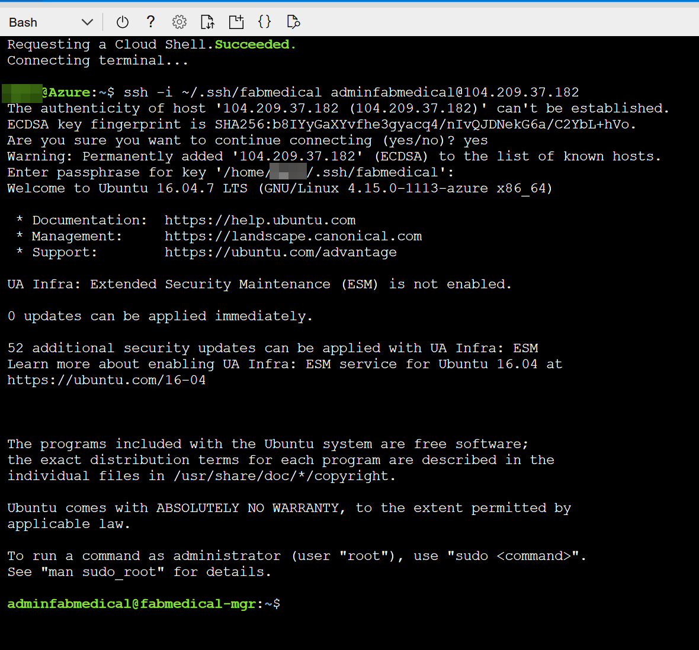
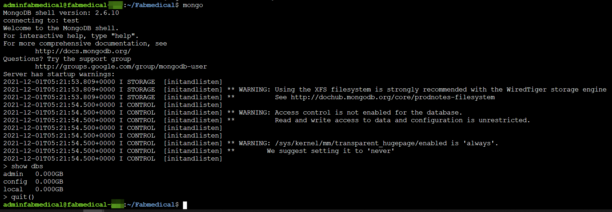
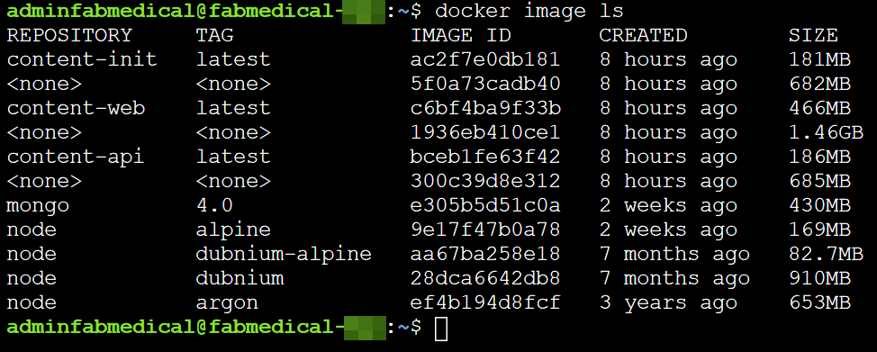
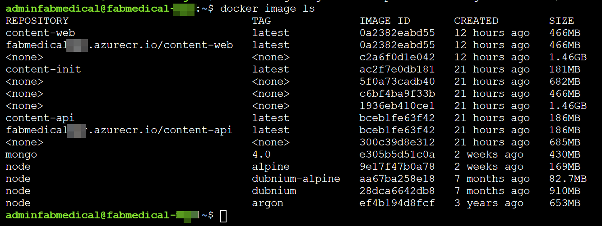
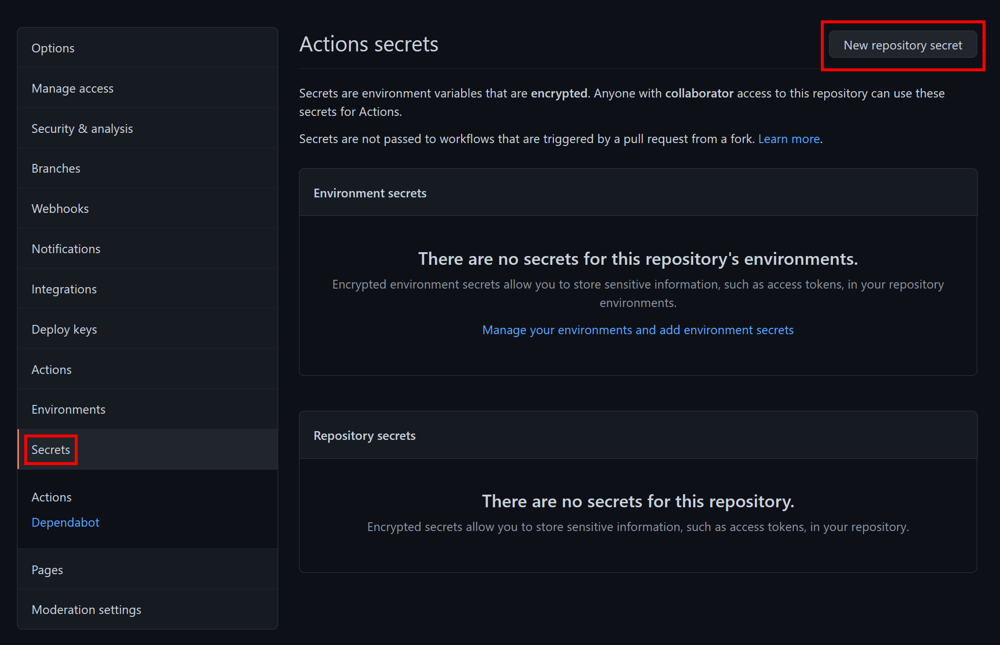
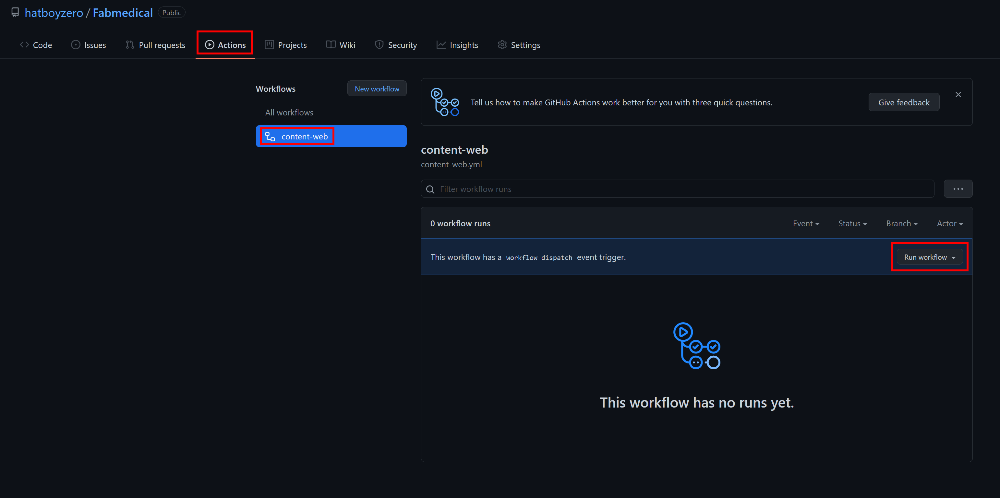
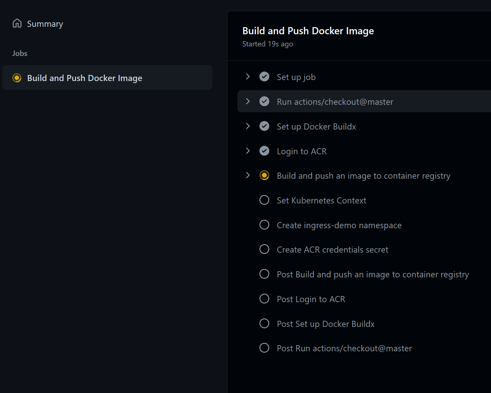

## Before the hands-on lab

**Duration**: 60 minutes

You should follow all of the steps provided in this section _before_ taking part in the hands-on lab ahead of time as some of these steps take time.

### Task 1: Setup Azure Cloud Shell
1. In the **JumpVM** provided to you on the left side, double click on the **Azure Portal** browser shortcut on the desktop.
 
   
   
1. Click on **Get Started** on Edge browser.

   
   
1. Now, click on the cross icon to close **Let's set up your new tab page**.

   
   
1. Close the current tab by clicking on close tab icon and then **Sign in Microsoft Azure** tab will open.
 
   
 
1. On **Sign in to Microsoft Azure** tab, **Sign in** with following Azure credentials.
 
     * Azure Usename/Email: <inject key="AzureAdUserEmail"></inject> 
 
     * Azure Password: <inject key="AzureAdUserPassword"></inject> 
 
1. If you see the pop-up **Stay Signed in?**, click Yes. 
 
1. If you see the pop-up **You have free Azure Advisor recommendations!**, close the window to continue the lab. 
 
1. If a **Welcome to Microsoft Azure** popup window appears, click **Maybe Later** to skip the tour.

1. In the **Azure portal**, open the **Azure Cloud Shell** by clicking on the cloud shell icon in the top menu bar. Alternatively, you can open cloud shell by navigating to ```https://shell.azure.com```.

   

1. After launching the Azure Cloud Shell, select the **Bash** option. Now on You have no storage mounted dialog box click on **Show advanced settings**. Select Create new under Storage account and provide values as below: 
  
      - **Storage account** : **storage{Deployementid}**
      - **File Share** : **blob**
  
    > **Note**: Storage account name should be always unique, you can get the Deployement Id  from the **Environment Details** tab. 

   

### Task 2: Download Starter Files

In this task, you use `git` to copy the lab content to your cloud shell so that the lab starter files will be available.

1. Copy the following command to clone the lab files inside clouddrive directory and then delete **.git** directory, because **.git** directory is not required. Paste in cloudshell and then press `<ENTER>`:

     ```
     cd clouddrive
     git clone https://github.com/microsoft/MCW-Cloud-native-applications.git
     rm -rf MCW-Cloud-native-applications/.git

     ```

   

### Task 3: Create GitHub Personal Access Token

1. Ensure you are logged in to your GitHub account.

2. Create a Personal Access Token as described below:

   - In the upper-right corner of your GitHub page, click your profile photo, then click **Settings (1)** and in the left sidebar click **Developer settings (2)**.

     

   - Then in the left sidebar, click **Personal access tokens (3)** and select **Generate new token (4)** button on the right. Provide the GitHub password if prompted. 
   
     

3. Select the scopes or permissions you would like to grant this token

    - **Note**: Provide the following text in the note field, **<inject key="DevOps Token" />**. 
    
    - **Select scopes**:

        * repo - Full control of private repositories
        * workflow - Update GitHub Action workflows
        * write:packages - Upload packages to GitHub Package Registry
        * delete:packages - Delete packages from GitHub Package Registry
        * read:org - Read org and team membership, read org projects
  
      

    - Click **Generate token**.

      

4. Click on the Copy icon to copy the token to your clipboard and save it on your notepad. For security reasons, after you navigate off the page, you will not be able to see the token again. **DO NOT COMMIT THIS TO YOUR REPO!**

   

### Task 4: Create a GitHub repository

FabMedical has provided starter files for you. They have taken a copy of the websites for their customer Contoso Neuro and refactored it from a single node.js site into a website with a content API that serves up the speakers and sessions. This refactored code is a starting point to validate the containerization of their websites. Use this to help them complete a POC that validates the development workflow for running the website and API as Docker containers and managing them within the Azure Kubernetes Service environment.

1. In a new browser tab open ```https://www.github.com``` and Log in with your personal GitHub account.

    > **Note** : You have to use your own GitHub account. If you don't have a GitHub account then navigate to the following link ```https://github.com/join ``` and create one.

1. In the upper-right corner, expand the user drop down menu and select **Your repositories**.

    

1. Next to the search criteria, locate and select the **New** button.

    

1. On the **Create a new repository** screen, name the repository ```Fabmedical``` and select the **Create repository** button.

    

1. On the **Quick setup** screen, copy the **HTTPS** GitHub URL for your new repository, paste this in notepad for future use.

    

1. Now go back to the cloudshell window, if you have closed that open a **new** Azure Cloud Shell console.  You can do this by selecting the **Open new session** button from the first console, or navigating to ```https://shell.azure.com``` and logging in with the same lab credentials.

1. Navigate to the **FabMedical** source code folder and list the contents.

    ```
    cd ~/clouddrive/MCW-Cloud-native-applications/'Hands-on lab'/lab-files/developer/
    ls

    ```

1. You'll see the listing includes three folders, one for the web site, another for the content API and one to initialize API data:

    ```
    content-api/
    content-init/
    content-web/
    ```

1. Set your username and email, which git uses for commits, run below commands:
  
    ```
    git config --global user.email "you@example.com"
    git config --global user.name "Your Name"
    ```

1. Using the Cloud Shell, initialize a new git repository:

    ```
    git init
    git add .
    git commit -m "Initial Commit"
    
    ```

1. Set the remote origin to the GitHub URL by issuing the following command, replace ```<your_github_username>``` with your Github username.

    ```
    git remote add origin https://github.com/<your_github_username>/Fabmedical    
    ```

1. Configure git CLI to cache your credentials, so that you don't have to keep re-typing them.

    ```
    git config --global --unset credential.helper
    git config --global credential.helper store
    
    ```

1. Push to the master branch by issuing the following command:

    ```
    git branch -m master main
    git push -u origin main
    
    ```

    > **Note**: If you have multi-factor authentication, you will need to create a personal access token when using the cloud shell. Refer the following link for help with setting up a GitHub personal access token to use for authenticating `git` with your GitHub account: ```https://docs.github.com/en/github/authenticating-to-github/creating-a-personal-access-token ```.

    > **Note**: Once you have your personal access token, retry the above command, use your token as the password.

1. Refresh your GitHub repository, you should now see the code published.

### Task 5: Connect securely to the build agent

In this section, validate that you can connect to the new build agent VM.

1. Connect to build agent vm using the **Command to Connect to Build Agent VM**, which is given on lab environment details page.

1. When asked to confirm if you want to continue connecting, type `yes`.

1. When asked for the password, enter **Build Agent VM Password** given below.
    ```
    Password.1!!
    ```

1. SSH connects to the VM and displays a command prompt such as the following. Keep this cloud shell window open for the next step.

   `adminfabmedical@fabmedical:~$`

   


### Task 6: Clone Repositories to the Build Agent

In this task, you clone your repositories from GitHub so you can work with them on the build agent.

1. As you previously did in cloud shell, set your username and email which are used for git commits.

   ```bash
   git config --global user.email "you@example.com"
   git config --global user.name "Your Name"
   ```

2. Configure git CLI to cache your credentials, so that you don't have to keep
   re-typing them.

   ```
   git config --global credential.helper cache
   
   ```

3. Use the GitHub URL to clone the repository code to your build agent machine. Replace ```<your_github_username>``` with your Github username.

   ```
   git clone https://github.com/<your_github_username>/Fabmedical 
   ```

### Task 7: Test the Starter Application

In this task, you will take the starter files and run the node.js application as a Docker application.  You will build the Docker images from the existing files and run containers to test and execute the application.

1. From Azure Cloud Shell, connect to your build agent if you are not already connected.

   

2. Type the following command to create a Docker network named `fabmedical`:

   ```bash
   docker network create fabmedical
   ```

3. Run an instance of mongodb to use for local testing.

   ```bash
   docker container run --name mongo --net fabmedical -p 27017:27017 -d mongo:4.0
   ```

   > **Note**:  With the existing source code written for MongoDB, it can be pointed towards the Azure Cosmos DB MongoDB API endpoint. The Azure Cosmos DB Emulator could be used for local development on Windows; however, the Cosmos DB emulator does not support Linux. As a result, when using Linux for development, MongoDB is still needed for local development environments; with Azure Cosmos DB used for data storage in the cloud. This allows existing source code written for MongoDB storage to be easily migrated to using Azure Cosmos DB backend.

4. Confirm that the mongo container is running and ready.

   ```bash
   docker container list
   docker container logs mongo
   ```

   

5. Connect to the mongo instance using the mongo shell and test some basic commands:

   ```bash
   mongo
   ```

   ```text
   show dbs
   quit()
   ```

   

6. To initialize the local database with test content, first navigate to the content-init directory and run npm install.

   ```bash
   cd ~/Fabmedical/content-init
   npm install
   ```

   > **Note**: In some cases, the `root` user will be assigned ownership of your user's `.config` folder. If this happens, run the following command to return ownership to `adminfabmedical` and then try `npm install` again:

   ```bash
   sudo chown -R $USER:$(id -gn $USER) /home/adminfabmedical/.config
   ```

7. Initialize the database.

   ```bash
   nodejs server.js
   ```

   

8. Confirm that the database now contains test data.

   ```bash
   mongo
   ```

   ```text
   show dbs
   use contentdb
   show collections
   db.speakers.find()
   db.sessions.find()
   quit()
   ```

   This should produce output similar to the following:

   

9. Now navigate to the `content-api` directory and run npm install.

   ```bash
   cd ../content-api
   npm install
   ```

   > **Note**: In some cases, the `root` user will be assigned ownership of your user's `.config` folder. If this happens, run the following command to return ownership to `adminfabmedical` and then try `npm install` again:

   ```bash
   sudo chown -R $USER:$(id -gn $USER) /home/adminfabmedical/.config
   ```

10. Start the API as a background process.

    ```bash
    nodejs ./server.js &
    ```

    

11. Press `ENTER` again to get to a command prompt for the next step.

12. Test the API using curl. You will request the speaker's content, and this will return a JSON result.

    ```bash
    curl http://localhost:3001/speakers
    ```

    

13. Navigate to the web application directory, run `npm install` and `ng build`.

    ```bash
    cd ../content-web
    npm install
    ng build
    ```

    

    > **Note**: In some cases, the `root` user will be assigned ownership of your user's `.config` folder. If this happens, run the following command to return ownership to `adminfabmedical` and then try `npm install` again:

    ```bash
    sudo chown -R $USER:$(id -gn $USER) /home/adminfabmedical/.config
    ```

14. Copy **Build Agent VM** public IP address from **Environment Details** tab, you will need this for future use.

       


15. From the cloud shell in the build machine edit the `app.js` file using vim.

    ```bash
    vim app.js
    ```

    Then press **_i_** to get into the edit mode, after that replace localhost with the build machine IP address.

    

    Then press **_ESC_**, write **_:wq_** to save you changes and close the file.
    
    **Note**: If **_ESC_** doesn't work press `ctrl+[` and then write **_:wq_** to save you changes and close the file.

16. Now run the content-web application in the background.

    ```bash
    node ./app.js &
    ```

    Press `ENTER` again to get a command prompt for the next step.

17. Test the web application using curl. You will see HTML output returned without errors.

    ```bash
    curl http://localhost:3000
    ```
    
    > **Note**:  If you get no such file or directory error, run the below command and retry step 17
    
     ```
     ng build
     ```
  
18. Leave the application running for the next task.

19. If you received a JSON response to the /speakers content request and an HTML response from the web application, your environment is working as expected.

20. Test the web application from a browser. Navigate to the web application using your build agent IP address at port `3000`. Get the Build Agent VM Ip from **Environment Details** tab.

    ```
    http://[BUILDAGENTVMIP]:3000
    ```
   
    > EXAMPLE: ```http://13.68.113.176:3000```
   
    

21. Select the Speakers and Sessions links in the header. You will see the pages display the HTML version of the JSON content you curled previously.

    

22. Once you have verified the application is accessible through a browser, go to your cloud shell window and stop the running node processes.

    ```
    killall nodejs
    killall node
   
    ```
   > **Note**: If cloud shell gets stuck, follow the below steps

   - Open a new Azure Cloud Shell console. You can do this by selecting the Open new session button from the first console, or navigating to ```https://shell.azure.com``` and logging in with the same lab credentials.

  - Connect to build agent vm using the Command to Connect to Build Agent VM, which is given on lab environment details page.

  - Run the following command:
   ```
   cd ~/Fabmedical/content-web
   ```

   
### Task 8: Build the Docker Images

In this task, you will build the Docker images for the application --- one for the API application and another for the web application. Each image will be created via Docker commands that rely on a Dockerfile.

1. From cloud shell connected to the build agent VM, type the following command to view any Docker images on the VM. The list will only contain the mongodb image downloaded earlier.

   ```bash
   docker image ls
   ```

2. From the content-api (`cd ~/Fabmedical/content-api`) folder containing the API application files and a Dockerfile, type the following command to create a Docker image for the API application. This command does the following:

   - Executes the Docker build command to produce the image

   - Tags the resulting image with the name `content-api` (-t)

   - The final dot (`.`) indicates to use the Dockerfile in this current directory context. By default, this file is expected to have the name `Dockerfile` (case sensitive).

   ```bash
   docker image build -t content-api .
   ```

3. Once the image is successfully built, run the Docker images listing command again. You will see several new images: the node images and your container image.

   ```bash
   docker image ls
   ```

   Notice the untagged image. This is the build stage which contains all the intermediate files not needed in your final image.

   

4. Navigate to the content-web folder again and list the files. Note that this folder also has a Dockerfile.

   ```bash
   cd ../content-web
   ll
   ```

5. View the Dockerfile contents. Type the following command:

   ```bash
   cat Dockerfile
   ```

   > Notice that the `content-web` Dockerfile build stage includes additional tools for a front-end Angular application in addition to installing npm packages.

6. Type the following command to create a Docker image for the web application.

   ```bash
   docker image build -t content-web .
   ```

7. Navigate to the content-init folder again and list the files. Note that this folder already has a Dockerfile.

   ```bash
   cd ../content-init
   ll
   ```

8. View the Dockerfile contents. Type the following command:

   ```bash
   cat Dockerfile
   ```

9.  Type the following command to create a Docker image for the init application.

     ```bash
      docker image build -t content-init .
     ```

10. When complete, you will see eight images now exist when you run the Docker images command.

   ```bash
   docker image ls
   ```

   

### Task 9: Run Docker Containers

The web application container will be calling endpoints exposed by the API application container and the API application container will be communicating with mongodb. In this exercise, you will launch the images you created as containers on the same bridge network you created when starting mongodb.

1. Create and start the API application container with the following command. The command does the following:

   - Names the container `api` for later reference with Docker commands.

   - Instructs the Docker engine to use the `fabmedical` network.

   - Instructs the Docker engine to use port `3001` and map that to the internal container port `3001`.

   - Creates a container from the specified image, by its tag, such as `content-api`.

   ```bash
   docker container run --name api --net fabmedical -p 3001:3001 content-api
   ```

2. The `docker container run` command has failed because it is configured to connect to mongodb using a localhost URL. However, now that content-api is isolated in a separate container, it cannot access mongodb via localhost even when running on the same docker host. Instead, the API must use the bridge network to connect to mongodb.

   ```text
   > content-api@0.0.0 start
   > node ./server.js

   Listening on port 3001
   Could not connect to MongoDB!
   MongooseServerSelectionError: connect ECONNREFUSED 127.0.0.1:27017
   npm notice
   npm notice New patch version of npm available! 7.0.8 -> 7.0.13
   npm notice Changelog: <https://github.com/npm/cli/releases/tag/v7.0.13>
   npm notice Run `npm install -g npm@7.0.13` to update!
   npm notice
   npm ERR! code 255
   npm ERR! path /usr/src/app
   npm ERR! command failed
   npm ERR! command sh -c node ./server.js

   npm ERR! A complete log of this run can be found in:
   npm ERR!     /root/.npm/_logs/2020-11-23T03_04_12_948Z-debug.log
   ```

3. The content-api application allows an environment variable to configure the mongodb connection string. Remove the existing container, and then instruct the docker engine to set the environment variable by adding the `-e` switch to the `docker container run` command. Also, use the `-d` switch to run the api as a daemon.

   ```bash
   docker container rm api
   docker container run --name api --net fabmedical -p 3001:3001 -e MONGODB_CONNECTION=mongodb://mongo:27017/contentdb -d content-api
   ```

4. Enter the command to show running containers. You will observe that the `api` container is in the list. Use the docker logs command to see that the API application has connected to mongodb.

   ```bash
   docker container ls
   docker container logs api
   ```

   

5. Test the API by curling the URL. You will see JSON output as you did when testing previously.

   ```bash
   curl http://localhost:3001/speakers
   ```

6. Create and start the web application container with a similar `docker container run` command -- instruct the docker engine to use any port with the `-P` command.

   ```bash
   docker container run --name web --net fabmedical -P -d content-web
   ```

7. Enter the command to show running containers again, and you will observe that both the API and web containers are in the list. The web container shows a dynamically assigned port mapping to its internal container port `3000`.

   ```bash
   docker container ls
   ```

   

8. Test the web application by fetching the URL with curl. For the port, use the dynamically assigned port, which you can find in the output from the previous command. You will see HTML output, as you did when testing previously.

   ```bash
   curl http://localhost:[PORT]/speakers.html
   ```

### Task 10: Setup Environment Variables

In this task, you will configure the `web` container to communicate with the API container using an environment variable, similar to the way the mongodb connection string is provided to the api.

1. From cloud shell connected to the build agent VM, stop and remove the web container using the following commands.

   ```bash
   docker container stop web
   docker container rm web
   ```

2. Validate that the web container is no longer running or present by using the `-a` flag as shown in this command. You will see that the `web` container is no longer listed.

   ```bash
   docker container ls -a
   ```

3. Review the `app.js` file.

   ```bash
   cd ../content-web
   cat app.js
   ```

4. Observe that the `contentApiUrl` variable can be set with an environment variable.

   ```javascript
   const contentApiUrl = process.env.CONTENT_API_URL || "http://[VM IP]:3001";
   ```

5. Open the Dockerfile for editing using Vim and press the `i` key to go into edit mode.

   ```bash
   vi Dockerfile
   <i>
   ```

6. Locate the `EXPOSE` line shown below and add a line above it that sets the default value for the environment variable, as shown in the screenshot.

   ```Dockerfile
   ENV CONTENT_API_URL http://localhost:3001
   ```

   

7. Press the Escape key and type `:wq` and then press the Enter key to save and close the file.

   ```text
   <Esc>
   :wq
   <Enter>
   ```

8. Rebuild the web application Docker image using the same command as you did previously.

   ```bash
   docker image build -t content-web .
   ```

9. Create and start the image passing the correct URI to the API container as an environment variable. This variable will address the API application using its container name over the Docker network you created. After running the container, check to see the container is running and note the dynamic port assignment for the next step.

   ```bash
   docker container run --name web --net fabmedical -P -d -e CONTENT_API_URL=http://api:3001 content-web
   docker container ls
   ```

10. Curl the speakers path again, using the port assigned to the web container. Again, you will see HTML returned, but because curl does not process javascript, you cannot determine if the web application is communicating with the api application. You must verify this connection in a browser.

    ```bash
    curl http://localhost:[PORT]/speakers.html
    ```

11. You will not be able to browse to the web application on the ephemeral port because the VM only exposes a limited port range. Now you will stop the web container and restart it using port `3000` to test in the browser. Type the following commands to stop the container, remove it, and run it again using explicit settings for the port.

    ```bash
    docker container stop web
    docker container rm web
    docker container run --name web --net fabmedical -p 3000:3000 -d -e CONTENT_API_URL=http://api:3001 content-web
    ```

    > **WARNING:** If you receive an error such as `Error starting userland proxy: listen tcp4 0.0.0.0:3000: bind: address already in use.` the previous Node instance might be holding the port 3000. Run `sudo pkill node` to kill the local node instance.

12. Curl the speaker path again, using port `3000`. You will see the same HTML returned.

    ```bash
    curl http://localhost:3000/speakers.html
    ```

13. You can now use a web browser to navigate to the website and successfully view the application at port `3000`. Replace `[BUILDAGENTIP]` with the **IP address** you used previously.

    ```bash
    http://[BUILDAGENTIP]:3000

    EXAMPLE: http://13.68.113.176:3000
    ```

14. Commit your changes and push to the repository.

    ```bash
    cd ~/Fabmedical
    git add .
    git commit -m "Setup Environment Variables"
    git push
    ```

    Enter credentials if prompted.

### Task 11: Push Images to Azure Container Registry

To run containers in a remote environment, you will typically push images to a Docker registry, where you can store and distribute images. Each service will have a repository that can be pushed to and pulled from with Docker commands. Azure Container Registry (ACR) is a managed private Docker registry service based on Docker Registry v2.

In this task, you will push images to your ACR account, version images with tagging, and setup continuous integration (CI) to build future versions of your containers and push them to ACR automatically.

1. In the Azure Portal `(https://portal.azure.com/)`, under navigate select **Resource groups** and click on **fabmedical-{DeploymentID}** resource group.

    
   
   Now on the resource group page select Azure container registry.
 
    


2. Select **Access keys** under **Settings** on the left-hand menu.

   

3. The Access keys blade displays the Login server, username, and password that will be required for the next step. Keep this handy as you perform actions on the build VM.

   > **Note**: If the username and password do not appear, select Enable on the Admin user option.

4. From the cloud shell session connected to your build VM, login to your ACR account by typing the following command. Follow the instructions to complete the login.

   ```bash
   docker login [LOGINSERVER] -u [USERNAME] -p [PASSWORD]
   ```

   For example:

   ```bash
   docker login fabmedicalsoll.azurecr.io -u fabmedicalsoll -p +W/j=l+Fcze=n07SchxvGSlvsLRh/7ga
   ```

   

   > **Tip**: Make sure to specify the fully qualified registry login server (all lowercase).

5. Run the following commands to properly tag your images to match your ACR account name.

   ```bash
   docker image tag content-web [LOGINSERVER]/content-web
   docker image tag content-api [LOGINSERVER]/content-api
   ```

   > **Note**: Be sure to replace the `[LOGINSERVER]` of your ACR instance.

6. List your docker images and look at the repository and tag. Note that the repository is prefixed with your ACR login server name, such as the sample shown in the screenshot below.

   ```bash
   docker image ls
   ```

   

7. Push the images to your ACR account with the following command:

   ```bash
   docker image push [LOGINSERVER]/content-web
   docker image push [LOGINSERVER]/content-api
   ```

   ![In this screenshot of the console window, an example of images being pushed to an ACR account results from typing and running the following at the command prompt: docker push [LOGINSERVER]/content-web.](media/image67.png "Push image to ACR")

8. In the Azure Portal, navigate to your ACR account, and select **Repositories** under **Services** on the left-hand menu. You will now see two containers **(2)**, one for each image.

   

9. Select `content-api` **(1)**. You will see the latest tag **(2)** is assigned.

   

10. From the cloud shell session attached to the VM, assign the `v1` tag to each image with the following commands. Then list the Docker images to note that there are now two entries for each image: showing the `latest` tag and the `v1` tag. Also note that the image ID is the same for the two entries, as there is only one copy of the image.

    ```bash
    docker image tag [LOGINSERVER]/content-web:latest [LOGINSERVER]/content-web:v1
    docker image tag [LOGINSERVER]/content-api:latest [LOGINSERVER]/content-api:v1
    docker image ls
    ```

    

11. Push the images to your ACR account with the following command:

    ```bash
    docker image push [LOGINSERVER]/content-web:v1
    docker image push [LOGINSERVER]/content-api:v1
    ```

12. Refresh one of the repositories to see the two versions of the image now appear.

    

13. Run the following commands to pull an image from the repository. Note that the default behavior is to pull images tagged with `latest`. You can pull a specific version using the version tag. Also, note that since the images already exist on the build agent, nothing is downloaded.

    ```bash
    docker image pull [LOGINSERVER]/content-web
    docker image pull [LOGINSERVER]/content-web:v1
    ```

### Task 12: Setup CI Pipeline to Push Images

In this task, you will use YAML to define a GitHub Actions workflow that builds your Docker
image and pushes it to your ACR instance automatically.

1. In GitHub, return to the **Fabmedical** repository screen, and select the **Settings** tab.

2. From the left menu, select **Secrets**.

3. Select the **New repository secret** button.

    

4. In the **New secret** form, enter the name `ACR_USERNAME` and for the value, paste in the Azure Container Registry **Username** that was copied previously. Select **Add secret**.

    

5. Add another Secret, by entering the name `ACR_PASSWORD` and for the value, paste in the Azure Container Registry **Password** that was copied previously.

    

6. In your Azure Cloud Shell session connected to the build agent VM, navigate to the `~/Fabmedical` directory:

   ```bash
   cd ~/Fabmedical
   ```

7. Before the GitHub Actions workflows can be setup, the `.github/workflows` directory needs to be created again and download workflow yml files. Do this by running the following commands:

    ```
    rm -rf ~/Fabmedical/.github/workflows/
    mkdir ~/Fabmedical/.github/workflows/
    cd ~/Fabmedical/.github/workflows/
    wget http://bit.ly/hol-content-web -O content-web.yml
    wget http://bit.ly/hol-content-api -O content-api.yml
    ```

8. Next create the workflow YAML file.
   
   ```dotnetcli
    vi content-web.yml
   ```

   - Replace `[DeploymentID]` with your DeploymentID value given on Environment details page.

       ```
       # Environment variables are defined so that they can be used throughout the job definitions.
       env:
        imageRepository: 'content-web'
        resourceGroupName: 'fabmedical-[DeploymentID]'
        containerRegistryName: 'acr[DeploymentID]'
        containerRegistry: 'acr[DeploymentID].azurecr.io'
        dockerfilePath: './content-web'
        tag: '${{ github.run_id  }}'

       ```
 
    


9. Save the file and exit VI by pressing `<Esc>` then `:wq`.

10. Save the pipeline YAML, then commit and push it to the Git repository:

    ```bash
    git add .
    git commit -m "Added workflow YAML"
    git push
    ```

11. In GitHub, return to the **Fabmedical** repository screen, and select the **Actions** tab.

12. On the **Actions** page, select the **content-web** workflow.

13. On the **content-web** workflow, select **Run workflow** and manually trigger the workflow to execute.

    

15. After a second, the newly triggered workflow execution will display in the list. Select the new **content-web** execution to view its status.

16. Selecting the **Build and Push Docker Image** job of the workflow will display its execution status.

    

17. Next, setup the `content-api` workflow. 

    ```
    cd ~/Fabmedical/.github/workflows
    vi content-api.yml
    
    ```

18. Edit the `resourceGroupName` by replacing the `[DeploymentID]` with your ```DeploymentID``` value.

    

19. Save the file, then commit and push it to the Git repository:
    ```bash
    git add .
    git commit -m "Updated workflow YAML"
    git push
    
    ```
20. Now navigate to the repositories in GitHub, select Actions, and then manually run the content-api workflow.

You should follow all steps provided _before_ performing the Hands-on lab.

